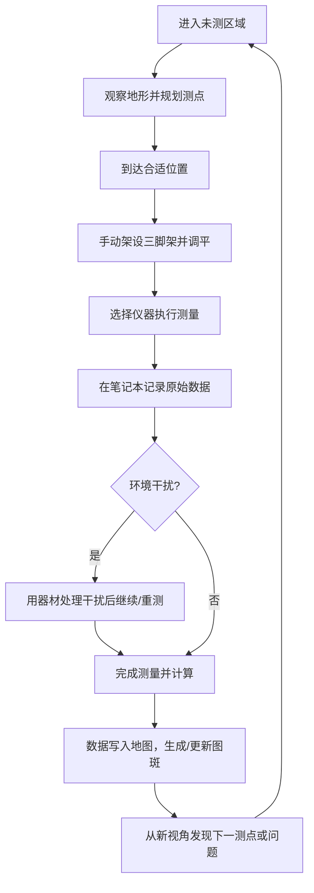

### 1.1 主核心循环

```mermaid
graph TD
    A[进入未测区域] --> B[观察地形并规划测点]
    B --> C[到达合适位置]
    C --> D[手动架设三脚架并调平]
    D --> E[选择仪器执行测量]
    E --> F[在笔记本记录原始数据]
    F --> G{环境干扰?}
    G -->|是| H[用器材处理干扰后继续/重测]
    H --> I[完成测量并计算]
    G -->|否| I
    I --> J[数据写入地图，生成/更新图斑]
    J --> K[从新视角发现下一测点或问题]
    K --> A
```
